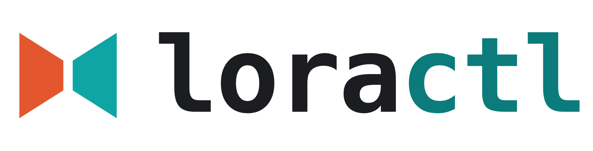

<div align="center">

<picture>
  <source media="(prefers-color-scheme: dark)" srcset="docs/brand/header-dark.png">
  
</picture>

**A terminal-native LoRA trainer, in Rust.**

[](https://github.com/laurigates/loractl/actions/workflows/ci.yml)
[](LICENSE)
[](Cargo.toml)

</div>

Most LoRA trainers bolt a half-baked web GUI onto a Python training core.
`loractl` inverts that: the **CLI is the primary surface** — config-driven,
completion-friendly, pipe-able — and a GUI, if anyone wants one, is just
another renderer layered on the same core over an API. The name says the
thesis: a `*ctl` tool, like `kubectl` or `systemctl`.

> **Status.** An early-stage learning project. The text-domain harness
> (M1–M5) and the Krea 2 image-diffusion stack (M6–M15) have landed, including
> the real-run interop proof — a LoRA trained on `krea/Krea-2-Raw` visibly
> conditions Krea-2-Turbo generation in ComfyUI, on a 24 GB card. Full
> milestone history: **[docs/roadmap.md](docs/roadmap.md)**.

## Why

- **The pipeline is the product.** No GUI plumbing to distract from
  dataloading, bucketing, the LoRA module, and the training loop.
- **CLI-first UX.** `clap`-generated shell completions, YAML configs with
  env/flag overrides, structured progress output.
- **GUI-optional by construction.** Core emits events; it never draws. The CLI
  renders them as a progress bar, and the HTTP API streams the same events as
  JSON — a GUI is just one more renderer.

## Architecture

Three crates, one direction of dependency (`cli → core`, `api → core`):

| Crate | Role |
|---|---|
| `loractl-core` | The pipeline: config schema, `TrainEvent` stream, `Trainer` trait, the LoRA modules + trainers, model loaders, generic adapter injection + kohya-ss export. **No CLI, no stdout.** |
| `loractl-cli` | The `loractl` binary. Parses args, layers config, renders events. |
| `loractl-api` | The HTTP/SSE server: streams the same events as JSON for an optional GUI. |

The load-bearing rule: **`loractl-core` never imports `clap` and never
prints.** A trainer reports progress by emitting `TrainEvent`s through a
callback; the caller decides how to surface them. That single discipline is
what makes "someone can build a GUI later" true instead of aspirational.

## Quickstart

```sh
# Build
cargo build

# Scaffold a starter config from a template (presets: synthetic, wgpu, flow, krea2)
cargo run -p loractl-cli -- init --preset krea2 -o config/my-lora.yaml

# Train the default synthetic LoRA-MLP demo from the example config
cargo run -p loractl-cli -- train config/examples/lora.yaml

# Override config fields from the CLI...
cargo run -p loractl-cli -- train config/examples/lora.yaml --lr 5e-5 --steps 2000

# ...or from the environment
LORACTL_OPTIM__LR=5e-5 cargo run -p loractl-cli -- train config/examples/lora.yaml

# Say more (or less): -v info, -vv debug, -vvv trace; -q errors only.
# Warnings print by default; RUST_LOG, when set, overrides these flags.
cargo run -p loractl-cli -- -v train config/examples/lora.yaml

# Generate shell completions
cargo run -p loractl-cli -- completions zsh > ~/.zfunc/_loractl
```

Recipes live in the `justfile` (`just` to list): `just build`, `just init`,
`just train`, `just completions fish`, `just lint`, `just fmt`, `just test`.

### Install

The workspace root is a virtual manifest, so `cargo install` must point at the
CLI crate. Default features are **empty** (CPU/ndarray only — this keeps `just
test` and CI offline and GPU-free), so pick the backend feature for your
hardware:

| Host | Features | Command |
|---|---|---|
| Any (CPU only) | — | `cargo install --path crates/loractl-cli` |
| macOS / Apple Silicon | `wgpu` (Metal) | `cargo install --path crates/loractl-cli --features wgpu` |
| Linux + NVIDIA, CUDA toolkit (`nvcc`) | `cuda,wgpu` | `cargo install --path crates/loractl-cli --features cuda,wgpu` |
| Linux without the CUDA toolkit | `wgpu` (Vulkan) | `cargo install --path crates/loractl-cli --features wgpu` |

`just install` runs this detection for you and prints what it picked; override
with `just install <features>` or `just install cpu`. On a Linux/NVIDIA host
that lacks the CUDA toolkit, `just install-cuda` installs it from NVIDIA's
official apt repo (toolkit only, never the driver).

A compiled-in feature only makes a backend *available* — the backend a run
actually uses is selected at runtime by `compute.backend` (see [Compute
backend](#compute-backend)), and selecting one the binary wasn't built with
fails loudly rather than falling back to CPU. The HTTP/SSE server is a
separate, CPU-only binary: `cargo install --path crates/loractl-api`.

## Usage

### Training & the correctness harness

- **Default trainer.** `loractl train` runs the real `BurnTrainer` on a seeded
  synthetic classification set — no network, no dataset needed (it warns that
  this is the synthetic demo). Point `model.base` at a `krea/Krea-2-Raw`-layout
  directory instead and core's `select_trainer` routes to the
  `DiffusionTrainer`.
- **Checkpoints** and the final adapter are written as real, interoperable
  **`.safetensors`** files — only the trainable LoRA tensors, never the frozen
  base — with a JSON sidecar carrying the seed/shape to reconstruct the base,
  and (on the diffusion path) an embedded `__metadata__` header carrying the
  trigger words and training record (see [below](#adapter-metadata--trigger-words-and-the-training-record)).
- **Numerics proof.** `just test` runs an always-on, offline test that pins the
  LoRA toy's trained factors and per-step losses against a checked-in PyTorch
  golden (`1e-5` tolerance; frozen base bit-exact), plus a black-box
  convergence test. `just test-mnist` adds an opt-in real-MNIST accuracy proof.

### Sampling & adapter I/O

`loractl sample` runs a real, reproducible forward pass through a saved
adapter. Because `LoraMlp` is a synthetic classifier with no tokenizer, a
prompt is hashed into a seed that deterministically derives the input — an
honest, reproducible effect, distinct from text generation (the CLI prints this
framing). Setting `output.sample_every: N` writes periodic validation samples
during training. Design and trade-offs:
[ADR-0002](docs/adrs/0002-adapter-format-and-sample-semantics.md).

```sh
cargo run -p loractl-cli -- sample output/my-lora.safetensors --prompt "a test prompt"
```

### Adapter metadata — trigger words and the training record

Every interop export (checkpoints and the final adapter) carries a
safetensors `__metadata__` header, the JSON block ahead of the tensor data
that ComfyUI, Forge, A1111, and Civitai read a LoRA's provenance from. loractl
writes both ecosystem vocabularies: kohya-ss/sd-scripts' `ss_*` training record
(`ss_network_dim`/`ss_network_alpha`, `ss_learning_rate`, `ss_optimizer`,
`ss_bucket_info`, `ss_tag_frequency` derived from your captions, …), Stability
AI's `modelspec.*` fields, and the two `sshs_*` file hashes
sd-webui-additional-networks indexes by.

Everything a run already knows is **derived** — you only configure what it
cannot infer:

```yaml
metadata:
  trigger_words: ["sks dog"]   # -> ss_trained_words + modelspec.trigger_phrase
  title: SKS dog
  author: you
  license: apache-2.0
  tags: [dog, pet]
```

`--trigger-word` overrides the list per run; `metadata.embed: false` (or
`--no-metadata`) writes no header at all, for a byte-reproducible export. The
block applies to the **diffusion** trainer's exports — the synthetic/MNIST
demo writes a burn-native adapter plus a JSON sidecar and ignores it.

Which keys a consumer actually reads is recorded (with where it was checked)
in `crates/loractl-core/src/metadata.rs` — notably `ss_tag_frequency`, which
is what surfaces a trigger word in A1111's LoRA metadata editor.
Read any `.safetensors` file's header back — tensors are never touched, so it
is instant even on a multi-gigabyte checkpoint:

```sh
loractl inspect output/my-lora.safetensors        # grouped listing
loractl inspect output/my-lora.safetensors --json # the raw map
```

### HTTP API

`just serve` runs `loractl-api` (bind via `LORACTL_API_ADDR`, default
`127.0.0.1:3000`) — the same event pipeline as the CLI, rendered as JSON over
SSE:

- `POST /runs` — start a run from a JSON `TrainConfig`; returns
  `201 {"id":1,"events_url":"/runs/1/events"}`.
- `GET /runs/{id}/events` — SSE stream: full replay from event 0, then live
  tail, ending with exactly one terminal event (`finished`/`failed`).

The API is **unauthenticated by default**; the localhost bind is what makes
that safe and it is enforced — a non-loopback bind refuses to start unless
`LORACTL_API_TOKEN` is set. Output paths are confined under
`LORACTL_OUTPUT_BASE`, with `LORACTL_MAX_CONCURRENT_RUNS` and
`LORACTL_RUN_RETENTION` bounding concurrency and memory. The full wire contract
lives in [docs/api/events.md](docs/api/events.md); the design decisions in
[ADR-0003](docs/adrs/0003-http-api-event-streaming.md).

### Real base models

loractl's first real base model was the **GPT-2 family**
(`openai-community/gpt2`): a hand-built, pre-LayerNorm GPT-2 loads unmodified HF
safetensors via `burn-store` and re-expresses the forward pass, checked against
PyTorch for parity stage by stage (always-run tiny fixture + opt-in real
`gpt2`). See [ADR-0001](docs/adrs/0001-first-real-target-model.md). The current
target is **Krea 2** ([`krea/Krea-2-Raw`](https://huggingface.co/krea/Krea-2-Raw)),
an open-weights ~12B rectified-flow image model — its
VAE, text encoder, MMDiT denoiser, dataset pipeline, and end-to-end
`DiffusionTrainer` are all in place. See
[ADR-0004](docs/adrs/0004-krea2-image-diffusion-target.md) and the
[roadmap](docs/roadmap.md).

## Config

A run is fully described by a YAML config (see `config/examples/lora.yaml`).
Precedence, lowest to highest: **YAML file → `LORACTL_`-prefixed env vars →
CLI flags.** Nested keys use `__` in env vars (`LORACTL_OUTPUT__DIR=/tmp/out`).

### Dataset

The diffusion path reads a **kohya-style folder**: images alongside same-stem
`.txt` caption files. An image with no caption file trains as an
*unconditional* example — valid data, not an error.

```yaml
dataset:
  path: /path/to/my-images   # images + same-stem .txt captions
  resolution: 512            # must be a multiple of 16
  batch_size: 1              # per bucket — batches never mix buckets
```

- **Any size and aspect ratio is accepted — no pre-processing needed.** Each
  image is cover-resized and center-cropped into the nearest of seven
  aspect-ratio buckets (1:1, 4:3, 3:4, 3:2, 2:3, 16:9, 9:16), each sized to
  roughly `resolution²` pixels. That crop is **lossy at the edges**: an image
  far from every bucket's aspect loses the overflow, so crop it yourself when
  the subject sits near a border.
- **`.png`, `.jpg`, `.jpeg` only** — every other extension is skipped
  *silently*. A folder of `.webp` therefore reads as empty and fails fast (`no
  .png/.jpg/.jpeg images found in …`); a folder with a few of them quietly
  trains on fewer images than you counted.
- **`resolution` must be a multiple of 16** (Krea 2's compression × patch
  grid). An unaligned value is a config error, not a panic.

> **Editing a dataset in place? Delete `.loractl-cache/` first.** Latents and
> conditioning are encoded once and cached under `<dataset>/.loractl-cache/`,
> keyed by file name, bucket shape, and encoder identity — deliberately **not**
> by content. Overwriting `dog.png` or rewriting `dog.txt` under the same name
> serves the previous run's tensors, silently. Adding, removing, or renaming
> files is safe; editing one in place is not.

The pipeline itself — bucket generation, the cache layout and its fingerprint
keying, and the encode-once-per-example contract — is documented in
[`crates/loractl-core/src/dataset.rs`](crates/loractl-core/src/dataset.rs).

### Compute backend

An optional `compute:` block selects the backend and device at run time:

```yaml
compute:
  backend: ndarray          # ndarray (default, CPU) | wgpu (GPU) | cuda | tch
  device: 0                 # GPU ordinal; ignored by ndarray
  precision: f32            # f32 (default) | f16 (wgpu only — halves weight memory; f16 autodiff is broken on every GPU backend, burn#5162)
  grad_checkpointing: false # recompute activations during backward (numerically identical)
  quant: none               # none (default) | int8 | int4 (frozen-base quant; ndarray/cuda + f32 only)
```

- **`ndarray`** is the default and always available — no build feature, so
  `just test` and CI stay offline and GPU-free.
- **`wgpu`** is the GPU backend (Metal on macOS, Vulkan/DX12 elsewhere), opt-in
  behind a build feature and the one GPU path verified on the dev machine
  (`just test-wgpu` — an end-to-end training smoke on the small synthetic
  model; burn#5162 needs the MMDiT graph to fire, which this smoke never
  builds — see `.claude/rules/burn-wgpu-metal-numerics.md`).
- **`cuda`** (needs the CUDA toolkit at build time) is wired into both
  trainers, **f32-only** — burn's non-f32 autodiff produces exactly-zero
  adapter gradients on cuda
  ([burn#5162](https://github.com/tracel-ai/burn/issues/5162)). cuda f32 is
  the first fully-clean GPU configuration: the wgpu f32 path matches CPU
  bit-identically only with the input-tracking workaround, and every f16 path
  is broken on both backends. `tch` (libtorch) remains compile-gated.

Selecting a GPU backend in a binary built **without** its feature fails loudly
(never a silent CPU fallback). The GPU backend is a **portability** target (the
loop runs, loss decreases), not a bit-exact numerics one — the numerics-golden
tests stay on ndarray, since GPU float-reduction order differs.

### Memory knobs — precision, checkpointing, quantization

Fitting the ~12.8B Krea 2 base on a single GPU is a memory problem, addressed
by three orthogonal knobs above: `precision: f16` (wgpu, ~24.6 GB on a 48 GiB
host — **the wgpu f16 route is currently blocked by
[burn#5162](https://github.com/tracel-ai/burn/issues/5162); cuda f32 + int4 is
the working 24 GB route**), `grad_checkpointing`, and frozen-base `quant:
int8`/`int4` (the QLoRA pattern — quantized frozen base, f32 adapters;
`ndarray`/`cuda` + f32 only).
The monolithic training step is **VRAM-bound** on a 24 GB card at *any* LoRA
target set — a single trained site peaks like all 196, because retention is
topology-driven; **int4 + block-level gradient checkpointing is the route that fixes
it**, measured at 19.4 GB peak (512px, 196/196 sites). The full analysis is
[ADR-0005](docs/adrs/0005-int4-training-vram-bound.md); the precision-accuracy
trade-off is [ADR-0006](docs/adrs/0006-reduced-precision-accuracy-gate.md).

What that route costs in time: on an **RTX 4090**, Krea 2 at 512px with
`quant: int4` and `grad_checkpointing: true` trains at **~4.5 s/step with a
19.7 GB peak** (batch 1, cuda + f32). Measured, single run — see
[the roadmap](docs/roadmap.md#first-measured-throughput-on-the-4090-110-2026-08-05)
for the configuration it holds for and what it does not license. It is **not**
comparable to other trainers' published `s/it`: a step time belongs to the
model and config, not the trainer.

## Observability (GlitchTip / Sentry)

`loractl` reports errors and panics to a [GlitchTip](https://glitchtip.com) /
Sentry-protocol instance. Telemetry is **opt-in via one env var** and a
complete no-op when unset:

```sh
export SENTRY_DSN='http://<key>@<host>/<project-id>'
loractl train config/examples/lora.yaml
```

Panics and fatal command errors become issues; `tracing::error!` events become
issues and `warn!`/`info!` become breadcrumbs. Delivery is independent of the
console log level (`-v`/`-q`/`RUST_LOG`), so telemetry never hinges on how
verbose the terminal output is.

Console verbosity itself: warnings and errors print by default, `-v`/`-vv`/`-vvv`
add info/debug/trace, and `-q` drops to errors only. The flags raise the level
for **loractl's own logs only** — third-party crates stay at `warn`, so `-vv` on
a GPU build does not bury the run under wgpu/naga chatter. A non-empty
`RUST_LOG` overrides the flags entirely and is the escape hatch for everything
else (`RUST_LOG=wgpu_core=debug,warn`).

At `-v` and above, each setup phase — the one-time dataset encode, the
multi-gigabyte checkpoint loads, quantization, LoRA injection — also leaves a
scrollback line, throttled to roughly one per 10% of a countable phase — except
dataset-encode cache misses, which report per example because each miss is
minutes of work.

Progress goes to **stderr** (the bar, the log lines); stdout carries only the
final `adapter: <path>`. When *stderr* is not a terminal — `nohup … > train.log
2>&1`, a dispatched `gpu.yml` — indicatif draws nothing, so the phase lines
print at the default level instead, and a redirected log never sits empty
through a 40-minute setup. Redirecting stdout alone (`… > train.log`) leaves
stderr a terminal, so there you still get the live bar. `-q` silences the lines
either way.

## Roadmap

Milestones are tracked as GitHub issues; the detailed history lives in
**[docs/roadmap.md](docs/roadmap.md)**.

- [x] **M1–M5 — Text-domain harness.** Skeleton + config layering + events
      (M1); burn `BurnTrainer` with a PyTorch numerics golden (M2, [#1](https://github.com/laurigates/loractl/issues/1));
      real GPT-2 loader with forward-pass parity (M3, [#2](https://github.com/laurigates/loractl/issues/2)); safetensors
      adapter I/O + sampling (M4, [#3](https://github.com/laurigates/loractl/issues/3)); HTTP/SSE API crate (M5, [#4](https://github.com/laurigates/loractl/issues/4)).
- [x] **M6–M13 — Krea 2 building blocks.** Generic LoRA injection + kohya-ss
      export (M6, [#17](https://github.com/laurigates/loractl/issues/17)); GPU compute backend (M7, [#18](https://github.com/laurigates/loractl/issues/18)); rectified-flow
      objective (M8, [#19](https://github.com/laurigates/loractl/issues/19)); Qwen-Image VAE (M9, [#20](https://github.com/laurigates/loractl/issues/20)); Qwen3-VL text encoder
      (M10, [#21](https://github.com/laurigates/loractl/issues/21)); MMDiT denoiser (M11, [#22](https://github.com/laurigates/loractl/issues/22)); image dataset pipeline (M12,
      [#23](https://github.com/laurigates/loractl/issues/23)); single-GPU 12B memory knobs (M13, [#24](https://github.com/laurigates/loractl/issues/24)).
- [x] **M14 — End-to-end + interop** ([#25](https://github.com/laurigates/loractl/issues/25)). `DiffusionTrainer` composes
      the whole stack; a 300-step LoRA trained on `krea/Krea-2-Raw` visibly
      conditions Krea-2-Turbo generation in ComfyUI
      (`config/examples/krea2-dog.yaml`). The 24 GB training route — cuda +
      int4 + block-level gradient checkpointing ([#134](https://github.com/laurigates/loractl/issues/134)) —
      measures 19.4 GB peak; the VRAM investigation is
      [ADR-0005](docs/adrs/0005-int4-training-vram-bound.md).
- [x] **M15 — Train on Krea-2-Turbo** ([#82](https://github.com/laurigates/loractl/issues/82)). `variant: krea2-turbo` +
      scaled-fp8 checkpoint loading; resolution-based timestep shift
      ([#84](https://github.com/laurigates/loractl/issues/84)).

## Contributing

See [CONTRIBUTING.md](CONTRIBUTING.md). Conventional commits are required
(release-please drives versioning); the local gate mirrors CI — run
`just fmt-check && just lint && just test` before opening a PR.

## License

MIT © Lauri Gates
